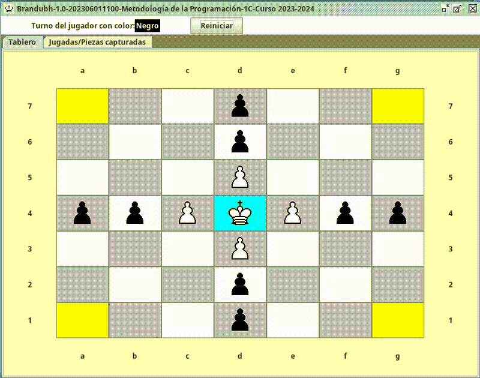

# Brandubh ♟️

Implementación del clásico juego de mesa celta Brandubh en Java con interfaz gráfica.
Desarrollado en 2º de Ingeniería Informática — Metodología de la Programación (UBU).



## Tecnologías
- Java (Swing via librería GUI proporcionada)
- Arquitectura MVC
- Lógica de movimientos, capturas y condiciones de victoria

## Ejecutar
Requiere Java instalado.
```bash
java -jar brandubh.jar
```

## Descargar
En la sección [Releases](../../releases) puedes descargar el JAR ejecutable directamente.

## Estructura
- `src/brandubh/modelo/` — Tablero, piezas, jugadas
- `src/brandubh/control/` — Árbitro, reglas del juego
- `src/brandubh/util/` — Coordenadas, colores, tipos
- `src/brandubh/textui/` — Interfaz de texto
